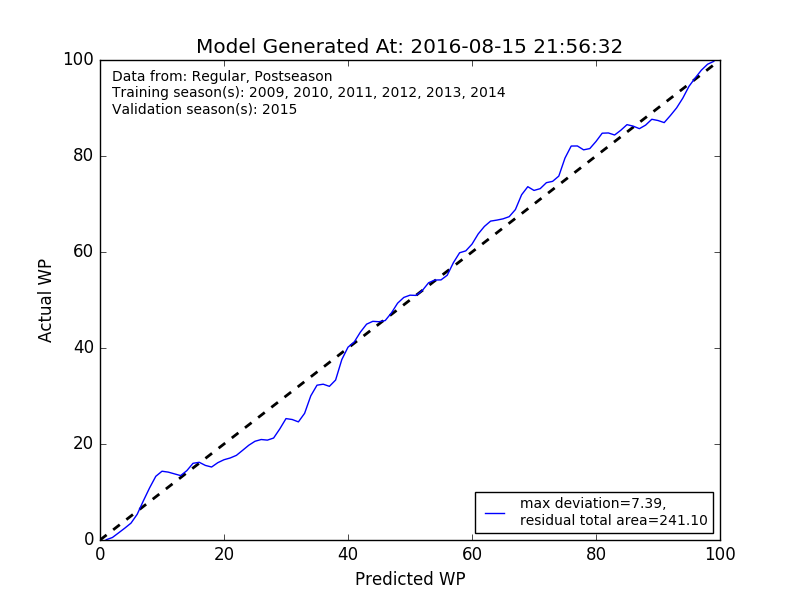

Creating a New WP Model
==============================
While NFLWin ships with a fairly robust default model, there is always
room for improvement. Maybe there's a new dataset you want to use to
train the model, a new feature you want to add, or a new machine
learning model you want to evaluate.

Good news! NFLWin makes it easy to train a new model, whether you just
want to refresh the data or to do an entire refit from scratch. We'll
start with the simplest case:

Default Model, New Data
-----------------------
Refreshing the data with NFLWin is a snap. If you want to change the
data used by the default model but keep the source as nfldb, all you
have to do is override the default keyword arguments when calling the
:meth:`~nflwin.model.WPModel.train_model` and :meth:`~nflwin.model.WPModel.validate_model`
methods. For instance, if for some insane reason you wanted to train on the 2009 and 2010 regular
seasons and validate on the 2011 and 2012 playoffs, you would do the following:
  
.. code-block:: python

  >>> from nflwin.model import WPModel
  >>> new_data_model = WPModel()
  >>> new_data_model.train_model(training_seasons=[2009, 2010], training_season_types=["Regular"])
  >>> new_data_model.validate_model(validation_seasons=[2011, 2012], validation_season_types=["Postseason"])
  (21.355462918011327, 565.56909036318007)

If you want to supply your own data, that's easy too - simply set the
`source_data` kwarg of :meth:`~nflwin.model.WPModel.train_model` and
:meth:`~nflwin.model.WPModel.validate_model` to be a Pandas DataFrame of your training and validation data (respectively):

..
  from nflwin.utilities import get_nfldb_play_data
  training_data = get_nfldb_play_data(season_years=[2012, 2013])
  validation_data = get_nfldb_play_data(season_years=[2014])
  
.. code-block:: python

  >>> from nflwin.model import WPModel
  >>> new_data_model = WPModel()
  >>> training_data.head()
        gsis_id  drive_id  play_id offense_team  yardline  down  yards_to_go  \
  0  2012090500         1       35          DAL     -15.0     0            0   
  1  2012090500         1       57          NYG     -34.0     1           10   
  2  2012090500         1       79          NYG     -34.0     2           10   
  3  2012090500         1      103          NYG     -29.0     3            5   
  4  2012090500         1      125          NYG     -29.0     4            5   
  
    home_team away_team offense_won quarter  seconds_elapsed  curr_home_score  \
  0       NYG       DAL        True      Q1              0.0                0   
  1       NYG       DAL       False      Q1              4.0                0   
  2       NYG       DAL       False      Q1             11.0                0   
  3       NYG       DAL       False      Q1             55.0                0   
  4       NYG       DAL       False      Q1             62.0                0   
  
     curr_away_score  
  0                0  
  1                0  
  2                0  
  3                0  
  4                0 
  >>> new_data_model.train_model(source_data=training_data)
  >>> validation_data.head()
        gsis_id  drive_id  play_id offense_team  yardline  down  yards_to_go  \
  0  2014090400         1       36          SEA     -15.0     0            0   
  1  2014090400         1       58           GB     -37.0     1           10   
  2  2014090400         1       79           GB     -31.0     2            4   
  3  2014090400         1      111           GB     -26.0     1           10   
  4  2014090400         1      132           GB     -11.0     1           10   
  
    home_team away_team offense_won quarter  seconds_elapsed  curr_home_score  \
  0       SEA        GB        True      Q1              0.0                0   
  1       SEA        GB       False      Q1              4.0                0   
  2       SEA        GB       False      Q1             30.0                0   
  3       SEA        GB       False      Q1             49.0                0   
  4       SEA        GB       False      Q1             88.0                0   
  
     curr_away_score  
  0                0  
  1                0  
  2                0  
  3                0  
  4                0  
  >>> new_data_model.validate_model(source_data=validation_data)
  (8.9344062502671591, 265.7971863696315)

Building a New Model
--------------------
If you want to construct a totally new model, that's possible
too. Just instantiate
:class:`~nflwin.model.WPModel`, then replace the
:attr:`~nflwin.model.WPModel.model` attribute with either a
scikit-learn `classifier
<http://scikit-learn.org/stable/auto_examples/classification/plot_classifier_comparison.html>`_
or `Pipeline
<http://scikit-learn.org/stable/modules/generated/sklearn.pipeline.Pipeline.html>`_. From
that point :meth:`~nflwin.model.WPModel.train_model` and
:meth:`~nflwin.model.WPModel.validate_model` should work as normal.

.. note::
   If you create your own model, the
   :attr:`~nflwin.model.WPModel.column_descriptions` attribute will no longer be
   accurate unless you update it manually.
   
.. note::
   If your model uses a data structure other than a Pandas DataFrame,
   you will not be able to use the ``source_data="nfldb"`` default
   kwarg of :meth:`~nflwin.model.WPModel.train_model` and
   :meth:`~nflwin.model.WPModel.validate_model`. If you want to use nfldb
   data, query it through :func:`nflwin.utilities.get_nfldb_play_data`
   first and convert it from a DataFrame to the format required by your model.

Using NFLWin's Preprocessors
^^^^^^^^^^^^^^^^^^^^^^^^^^^^
While you can completely roll your own WP model from scratch, NFLWin
comes with several classes designed to aid in preprocessing your
data. These can be found in the appropriately named
:mod:`~nflwin.preprocessing` module. Each of these preprocessors inherits
from scikit-learn's BaseEstimator class, and therefore is fully
compatible with scikit-learn Pipelines. Available preprocessors
include:

* :class:`~nflwin.preprocessing.ComputeElapsedTime`: Convert the time
  elapsed in a quarter into the total seconds elapsed in the game.
* :class:`~nflwin.preprocessing.ComputeIfOffenseIsHome`: Create an
  indicator variable for whether or not the offense is the home team.
* :class:`~nflwin.preprocessing.CreateScoreDifferential`: Create a
  column indicating the difference between the offense and defense
  point totals (offense-defense). Uses home team and away team plus
  an indicator giving if the offense is the home team to compute.
* :class:`~nflwin.preprocessing.MapToInt`: Map a column of values to
  integers. Useful for string columns (e.g. a quarter column with "Q1", "Q2", etc).
* :class:`~nflwin.preprocessing.CheckColumnNames`: Ensure that only the desired data gets passed to
  the model in the right order. Useful to guarantee that the
  underlying numpy arrays in a Pandas DataFrame used for model
  validation are in the same order as they were when the model was
  trained.

To see examples of these preprocessors in use to build a model, look
at :meth:`nflwin.model.WPModel.create_default_pipeline`.

Model I/O
---------
To save a model to disk, use the
:meth:`nflwin.model.WPModel.save_model` method.

.. note::
   If you do not provide
   a filename, the default model will be overwritten and in order to
   recover it you will need to reinstall NFLWin (which will then
   overwrite any non-default models you have saved).

To load a model from disk, use the
:meth:`nflwin.model.WPModel.load_model` class method. By default this
will load the standard model that comes bundled with pip installs of
NFLWin. Simply specify the ``filename`` kwarg to load a non-standard
model.

.. note::
   By default, models are saved to and loaded from the path given by
   :attr:`nflwin.model.WPModel.model_directory`, which by default is
   located inside your NFLWin install.

Estimating Quality of Fit
-------------------------
When you care about measuring the probability of a classification
model rather than getting a yes/no prediction it is challenging to
estimate its quality. This is an area I'm actively looking to improve
upon, but for now NFLWin does the following.

First, it takes the probabilities given by the model for each play in the
validation set, then produces a `kernel density estimate
<https://en.wikipedia.org/wiki/Kernel_density_estimation>`_ (KDE) of all
the plays as well as just the ones that were predicted
correctly. The ratio of these two KDEs is the actual WP measured
from the test data set at a given *predicted* WP. While all of this is
measured in :meth:`~nflwin.model.WPModel.validate_model`, you can plot
it for yourself by calling the
:meth:`~nflwin.model.WPModel.plot_validation` method:

From there NFLWin computes both the maximum deviation at any given
percentage and the total area between the estimated WP from the model
and what would be expected if the model was perfect - that's what is
actually returned by
:meth:`~nflwin.model.WPModel.validate_model`. This is obviously not
ideal given that it's not directly estimating uncertainties in
the model, but it's the best I've been able to come up with so far. If anyone
has an idea for how to do this better I would welcome it enthusiastically.
